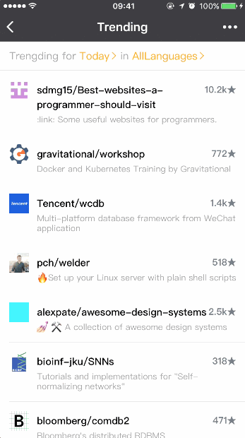
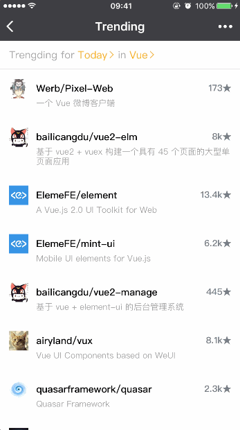
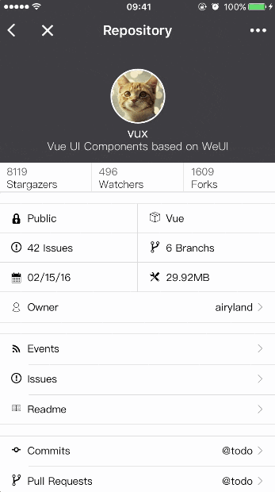
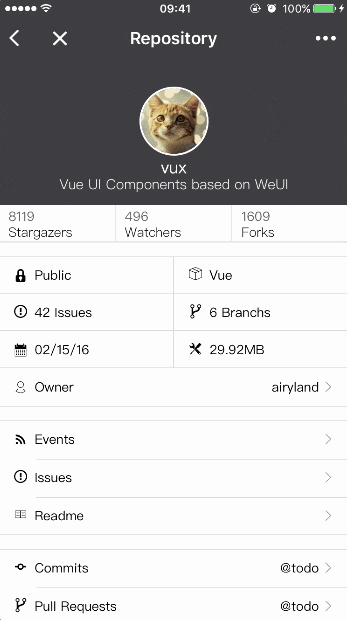

# 前言
小程序总体还是比App方便，而且直接可以打开，所以有了这个github的小程序端版本。

# 功能进度

* [x] `Trending` `1.0.0`
* [x] `Lnaguage` `1.1.0`
* [x] `Repository` `1.2.0`
* [x] `Readme` `1.2.0`
* [x] `Profile` `1.3.0`
* [x] `Events` `1.3.0` `1.5.1`
* [x] `Issues` `1.4.0`
* [x] `Issue-item` `1.4.1`
* [x] `Branch` `1.5.0`
* [x] `Commits` `1.5.0` `1.5.1`
* [x] `Pull Requests` `1.6.0`
* [x] `Profile Events` `1.7.0`
* [x] `Profile Repos` `1.8.0`
* [ ] `Source`
* [ ] `Search Repository`
* [ ] `Login By Github`

# 访问方式
小程序搜索：Github源
或者扫一扫二维码

# 示例截图

+ Trending and Languages

+ Repositories

+ Events

+ Issues

+ Readme

